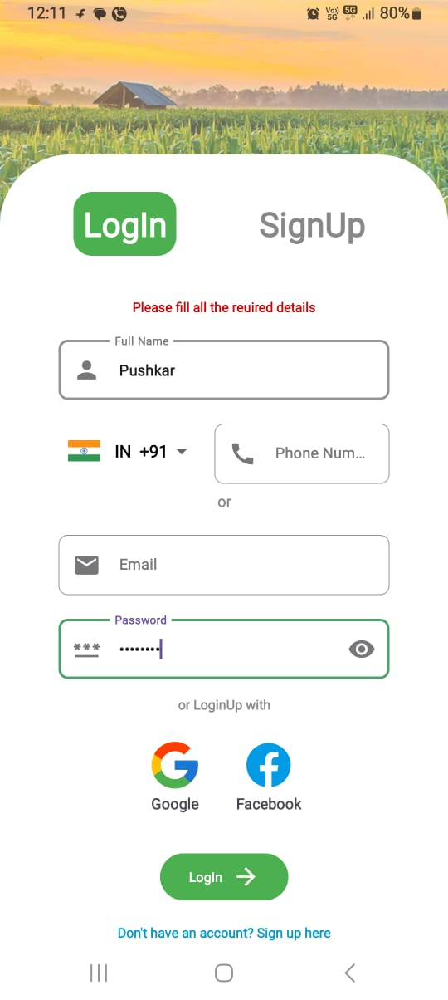
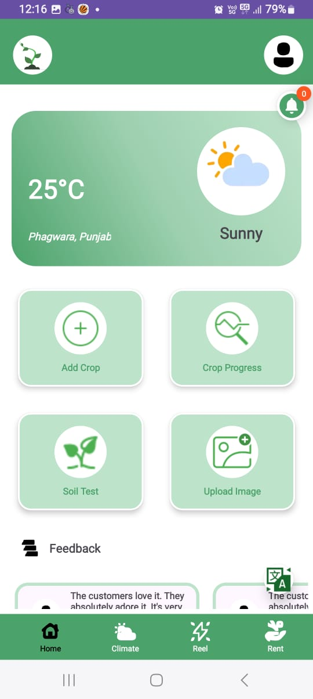
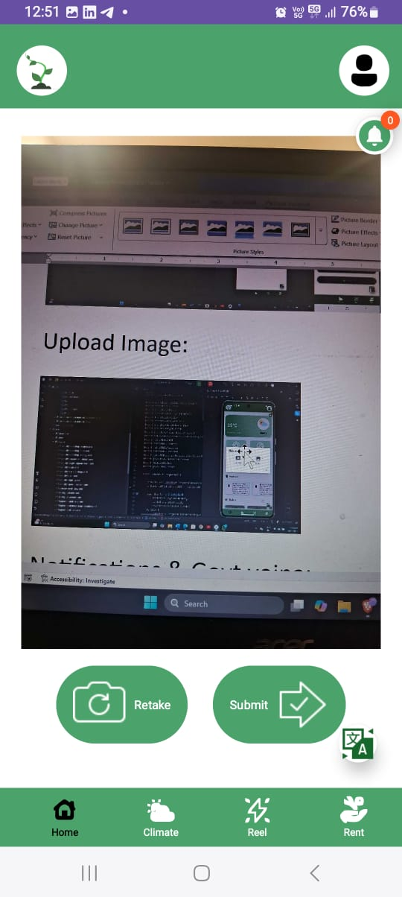
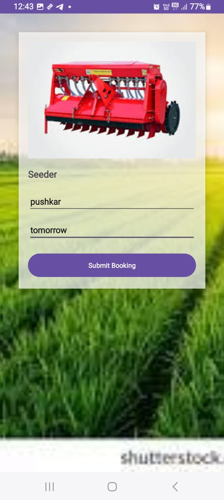
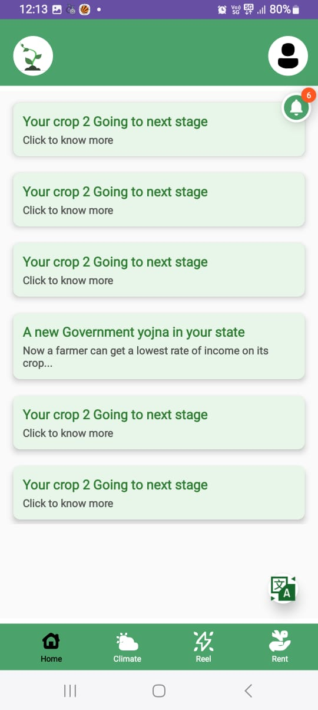
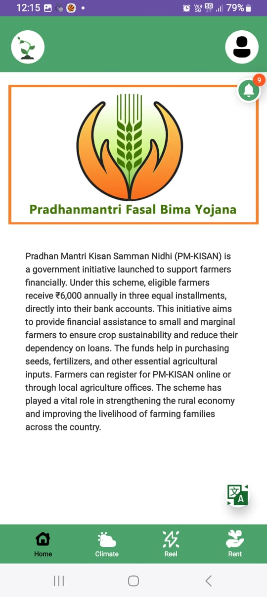
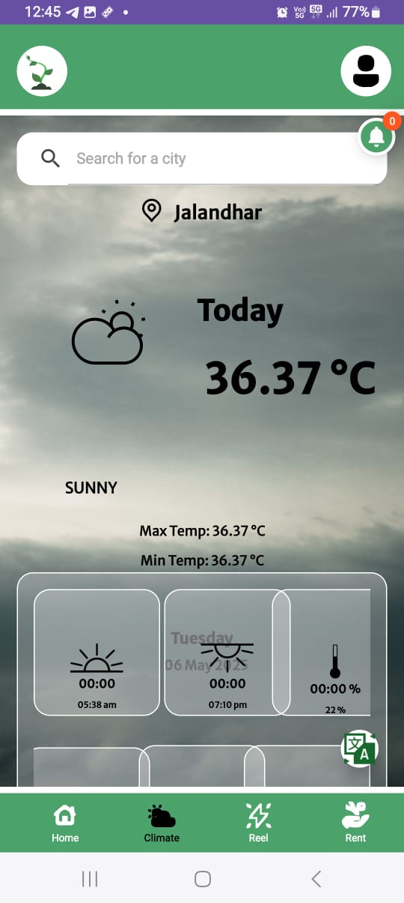
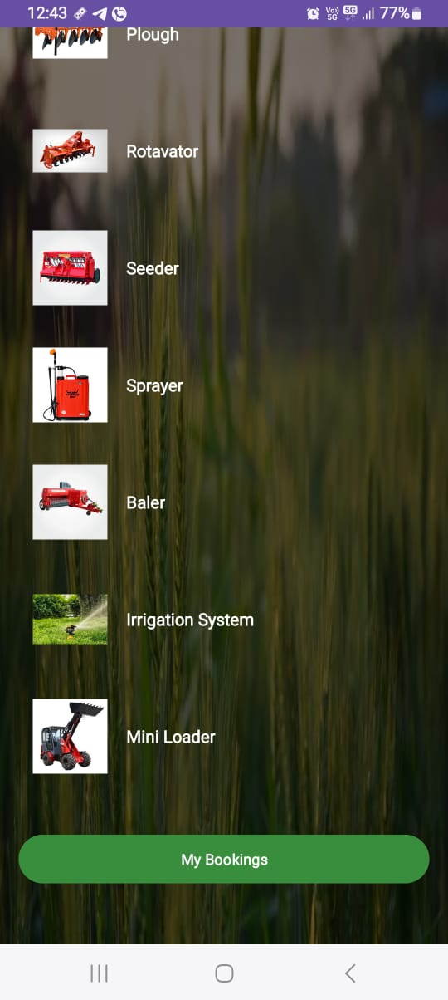

🌱 CropTrack – Farmer Friend (Android Application)

🎥 App Demonstration Video:
https://www.linkedin.com/posts/abhishekkumarnayak11_croptrack-agritech-androidapp-activity-7324764253721165824-ce4x

📌 Overview

CropTrack is an Android-based mobile application designed to assist farmers and agricultural professionals in tracking crop growth stages and managing essential farming resources. The application provides real-time insights to help users make informed decisions, improve productivity, and optimize crop yield.

By combining weather intelligence, crop monitoring, and resource management in a single platform, CropTrack aims to make agricultural operations smarter, more efficient, and accessible.

🚜 Key Features

Crop Growth Tracking: Monitor crop growth stages based on location and selected dates

Real-Time Weather Forecasting: Integrated live weather updates using Retrofit

Equipment Renting Module: Browse, rent, and manage farming equipment directly from the app

Field & Activity Tracking: Maintain crop records, growth progress, and farming activities

Smart Notifications: Receive timely reminders and alerts for farming tasks

User-Friendly UI: Clean and intuitive interface built using View Binding and Material components

🛠️ Tech Stack

Language: Kotlin

IDE: Android Studio

Architecture Components: Fragments, View Binding

Networking: Retrofit

Data Storage: SharedPreferences

UI Components: Material CardView

Background Processing: Threads & Handlers

📱 App Functionality

Dynamic crop selection with location and date-based input validation

Real-time weather data integration with contextual notifications

Equipment rental workflow for cost-effective access to machinery

Local data persistence with history tracking

Modular fragment navigation with runtime permission handling

🎯 Objective

CropTrack reduces guesswork in farming by delivering actionable insights through data-driven features. The app empowers farmers to manage crops and resources effectively while promoting modern, technology-driven agricultural practices.

🚀 Future Enhancements

Cloud-based data sync

AI-powered crop disease detection

Multi-language support

Market price prediction for crops

👤 Developer

Abhishek Kumar Nayak
Android Developer | Kotlin | Retrofit | UI/UX
🔗 LinkedIn: https://www.linkedin.com/in/abhishekkumarnayak11

## 📱 Application Screenshots

<table>

<tr>
<td align="center"><b>Login Page</b> </td>
<td align="center"><b>Home Dashboard</b> </td>
</tr>

<tr>
<td align="center"><b>Language Selection</b> </td>
<td align="center"><b>Hindi Support</b> </td>
</tr>

<tr>
<td align="center"><b>Add Crop</b> </td>
<td align="center"><b>Crop Details</b> </td>
</tr>

<tr>
<td align="center"><b>Camera Retake</b> </td>
<td align="center"><b>Gallery Upload</b> </td>
</tr>

<tr>
<td align="center"><b>Crop Location</b> </td>
<td align="center"><b>Crop Tracking</b> </td>
</tr>

<tr>
<td align="center"><b>Soil Data Entry</b> </td>
<td align="center"><b>Soil Module Page</b> </td>
</tr>

<tr>
<td align="center"><b>Soil Report Upload</b> </td>
<td align="center"><b>Soil Suitable Result</b> </td>
</tr>

<tr>
<td align="center"><b>Soil Not Suitable</b> </td>
<td align="center"><b>Upload Image</b> </td>
</tr>

<tr>
<td align="center"><b>Equipment Rental</b> </td>
<td align="center"><b>Saved Equipment</b> </td>
</tr>

<tr>
<td align="center"><b>Notifications</b> </td>
<td align="center"><b>Government Scheme Info</b> </td>
</tr>

<tr>
<td align="center"><b>Temperature Dashboard</b> </td>
<td align="center"><b>Rent Equipment</b> </td>
</tr>

<tr>
<td align="center"><b>Infection Detection</b> </td>
</tr>

</table>